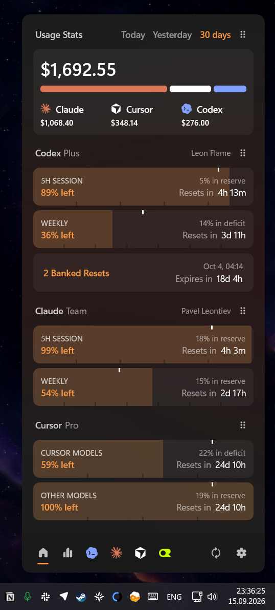
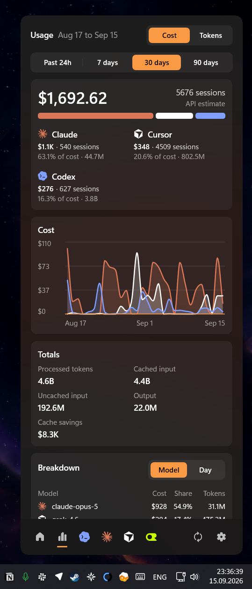

<p align="center">
  
</p>

<h1 align="center">Codex Minibar</h1>

<p align="center">
  <b>Free, open-source Windows tray companion for AI subscription usage limits with configurable tray widgets, a compact usage popup, notifications, auto-start, in-place updates, and local history.</b>
</p>

<p align="center">
  <a href="https://github.com/vertopolkaLF/codex-minibar/releases">Download</a>
  |
  <a href="https://vertopolkalf.github.io/codex-minibar/">Website</a>
  |
  <a href="https://github.com/vertopolkaLF/codex-minibar/issues">Issues</a>
</p>

<p align="center">
  
  
  
  
</p>

---

## Overview

Codex Minibar reads quota data from locally authenticated provider sessions and keeps subscription limits and reset times visible in the notification area. It is a native Windows application written in Rust, with the tray popup and Settings both rendered by GPUI.

> Codex Minibar is an independent project. It is not affiliated with, endorsed by, or sponsored by OpenAI.

<table>
  <tr>
    <td width="50%"></td>
    <td width="50%"></td>
  </tr>
</table>

## Features

- Show five-hour and weekly usage in one or more configurable tray icons.
- Choose numbers, bars, rings, reset times, or reset countdowns; show remaining or used
  percentage as appropriate.
- Track Kiro's monthly included credits and reset date in its provider card and tray widget.
- Open a compact native popup for the current plan, credits, limit windows, and local token
  statistics (today, the configured history window, and a compact activity bar chart).
- Receive Windows notifications when a limit resets, usage becomes low, Codex cannot be
  reached, or an update is available.
- Receive announced Codex forced-reset countdowns from the public GitHub feed. The feed
  contract and bot update rules live in [`docs/codex-resets-feed.md`](docs/codex-resets-feed.md).
- Optionally start Codex automatically to activate a fresh five-hour window.
- Configure planned limit activations and provider-specific quiet periods for
  automatic activation, such as keeping a work Claude session inactive on weekends.
- Use the optional Stream Deck companion to place independently configured quota
  indicators on hardware keys, open the popup or a provider tab, and launch Minibar
  on click when it is not running.
- Start with Windows, update in place from GitHub Releases, and retain history locally.
- Detect Codex installations automatically, with an override for a custom executable path.
- Enable Codex, Claude, Cursor, OpenCode Zen, OpenCode Go, OpenRouter, Antigravity, Grok, and Kiro independently in **Settings → Providers**. Providers refresh independently; Antigravity, Grok, and Kiro show subscription quota rather than unrelated API billing.

## Requirements

- Windows 10 or Windows 11 (64-bit ARM or x64).
- A locally installed and authenticated supported provider, or an OpenRouter API key.

The app does not copy provider credentials into its ordinary settings file. It talks to the local
Codex app server, reads Claude Code's existing local OAuth session, reads OpenCode's local
configuration/history, reuses the official Antigravity or Grok CLI sign-in, requests live Kiro
monthly credits with the shared Kiro sign-in and detects the Kiro IDE, Kiro Crew, and Kiro CLI as
available sources, or requests OpenRouter key usage. The Crew app is detected for per-user and
all-users installs and shares the same Kiro credit provider rather than adding a duplicate balance
card. The shared Kiro access token is read-only and never refreshed or written. The live endpoint
also supplies plan and account labels. If it is unavailable, Minibar falls back to the IDE's local
usage cache when available and keeps its own last stored Kiro snapshot. The endpoint is currently
undocumented by Kiro and may change. Kiro subscription credits stay separate from API-equivalent
Total Spend.
Optional OpenCode and OpenRouter manual API keys and saved Codex sessions and Claude profile credentials are protected with Windows user-scoped DPAPI
storage. The app stores its own settings and usage history in your Windows user profile.

Kiro's plan appears on its provider card. The account label uses Kiro's display name when available,
then its email address, and follows the **Show account name** preference. Redacted values are hidden.

For Antigravity, run `agy` and complete its normal sign-in once; Minibar reads that existing
Windows Credential Manager session and never stores it in app settings. For Grok, run `grok login`;
Minibar reads the official CLI auth cache. If either session expires, refresh it in the official CLI.
Browser-session access is not used.

### Add another Codex account

Open **Settings → Providers → Codex → Add account**, optionally name it, and click
**Sign in**. Finish authorization with the desired ChatGPT account in your browser
within five minutes. Requires native Codex CLI or Codex desktop; npm installations
are supported when their package contains the native Windows executable.

**Default** follows your existing Codex login (including `CODEX_HOME`). Additional
accounts use isolated logins, stored with Windows user-scoped DPAPI, and refresh
automatically. Adding or selecting an account does not switch your CLI or desktop
login. Each enabled account has independent limits and errors. Rename, disable,
remove, or sign in again from its account card; **Show on Home** affects only Home.
The Codex tab has an account switcher, or enable **Show accounts as separate tabs**
to give each Codex and Claude account its own numbered icon.

Tray quotas follow the provider-level account sample. Automatic and scheduled
activation use only the existing Default login; saved accounts are never activated.
Usage statistics still come from local CLI logs and retain their existing account
attribution; adding OAuth accounts does not create historical usage for them.

### Add another Claude account

Open **Settings → Providers → Claude → Add account**, optionally give the account a name,
and choose a connection method. The dialog includes instructions and clickable help links.
The built-in **Default** profile follows this PC's Claude Code or desktop login;
you can turn it off without removing your other profiles.
An empty name becomes the first available **Account 1**, **Account 2**, and so on;
you can rename it later.

- **Sign in**: requires native Windows Claude Code. Click **Sign in**, choose the
  subscription account in your browser, and complete authorization within five minutes.
  Minibar uses an isolated temporary configuration directory, keeps the complete session
  in Windows user-scoped encrypted storage, and refreshes its tokens automatically.
  Your current CLI and Desktop logins stay in place. **Cancel** stops the pending login.
  If the browser returns a code that needs a terminal, use the manual OAuth token method.
- **Browser session**: open [claude.ai](https://claude.ai) in a separate
  browser profile or private window and sign in to the second account. In Chrome or Edge,
  press **F12 → Application → Storage → Cookies → https://claude.ai**. Find `sessionKey`,
  copy its **Value**, and paste it into Minibar. See [Chrome's cookie guide](https://developer.chrome.com/docs/devtools/application/cookies).
- **OAuth token**: sign in to Claude Code with a separate configuration directory.
  See [Claude Code's multiple-account instructions](https://code.claude.com/docs/en/authentication#log-in-with-multiple-accounts).
  In a separate PowerShell window, run:

  ```powershell
  $env:CLAUDE_CONFIG_DIR = Join-Path $env:USERPROFILE '.claude-minibar-work'
  claude
  ```

  After signing in to the second subscription account, open
  `%USERPROFILE%\.claude-minibar-work\.credentials.json` and copy only
  `claudeAiOauth.accessToken`, without quotes. It starts with `sk-ant-oat`.
  If that file is unavailable, use Browser session. `claude setup-token` may lack usage
  access and is not a substitute for this login token.

For pasted credentials, click **Check and save**. Home shows the enabled profiles; the Claude tab lets you
switch between them. Expand the account card to change its name, toggle **Show on Home**,
or use **Update credential** when a cookie or token expires:
Minibar keeps the profile's name and enabled state. Pasted OAuth tokens are not
automatically refreshed. API keys and Admin API keys are not offered for subscription
account setup; organization API spending is a different metric.

Adding an account keeps the last successful limits for unchanged profiles while
the reader refreshes. If a refresh fails, those limits remain visible with their
original update time and an error. Removing, disabling, or replacing a profile's
credential clears only its sample. A partial HTTP 429 still pauses Claude polling.

## Install

1. Open the [latest release](https://github.com/vertopolkaLF/codex-minibar/releases/latest).
2. Download the installer matching your Windows architecture (`x64` or `arm64`) and run it.
   The installer is per-user and does not require administrator rights.
3. Alternatively, download the matching `portable.zip`, extract it, and run
   `codex-minibar.exe`.
   The NSIS installer also registers `minibar` as a launch alias for the same app.
4. Find the icon in the notification area. If it is hidden, Windows may have tucked it under
   the `^` overflow menu, because apparently that is where delightful UX goes to die.

On first run, Codex Minibar discovers Codex automatically. Open **Settings** from the tray
menu if you need to choose another executable or adjust the tray widgets and notifications.

To start the troubleshooting handoff, run `codex-minibar trouble` or `minibar trouble`.
The command scans for Codex and Claude Code, asks which one should investigate, then opens
a terminal with the shared Codex Minibar troubleshooting prompt. The same handoff is
available from **Settings → Log → Run Troubleshoot with AI**.

## Updating

By default, Codex Minibar checks GitHub Releases for updates and can install a matching
portable package in place. You can disable update checks in Settings at any time.

## Build from source

Install the Rust toolchain pinned in [`rust-toolchain.toml`](rust-toolchain.toml), then run:

```powershell
cargo check --locked
cargo test --all-targets --all-features --locked
cargo clippy --all-targets --all-features --locked -- -D warnings
```

To build distributable Windows packages, run:

```powershell
.\build.ps1
```

This produces architecture-specific portable ZIP files and NSIS installers under `dist/`.

## Development

Every window is rendered with [GPUI](https://gpui.rs) on one dedicated UI thread: the tray
popup, the Settings window and the first-launch onboarding. Settings controls (toggles,
dropdowns, sliders, text inputs, dialogs) live in `src/settings_window/kit.rs` and
`src/settings_window/input.rs`. No UI framework runtime is redistributed; the release
package is the executable plus its `assets` folder.
CI checks formatting, lints, and tests on Windows.

### Stream Deck companion

The optional companion lives in [`streamdeck/`](streamdeck/). It stores each key's
configuration in Stream Deck and reads sanitized quota snapshots from the running
Minibar process over loopback. With Node.js 24+ installed, build and package it with:

Each key can be configured as a single-limit ring for 5h or Weekly, with a
custom reset display, or as a combined 5h + Weekly widget.

```powershell
cd streamdeck
npm install
npm run build
npx @elgato/cli@latest validate .\com.vertopolkalf.codex-minibar.sdPlugin
npx @elgato/cli@latest pack .\com.vertopolkalf.codex-minibar.sdPlugin
```

The resulting `.streamDeckPlugin` file can be opened with Stream Deck Desktop.

Bug reports and focused pull requests are welcome. Please include your Windows version,
Codex installation type, and clear reproduction steps when reporting a problem.

## Contributing

We especially need help supporting the many different providers people use. Provider APIs,
local data formats, authentication flows, and quota semantics all vary, so testing integrations
with real provider accounts and keeping them working over time is particularly valuable.

To contribute:

1. Fork the repository and create a focused branch.
2. Make the smallest change that solves the problem.
3. Run the relevant checks from [Build from source](#build-from-source).
4. Open a pull request with a clear description, reproduction steps, and provider-specific
   setup details when applicable.

For provider changes, include sanitized sample data or fixtures when possible. Never commit
credentials, tokens, or personal usage history.

## License

Licensed under the [Apache License, Version 2.0](LICENSE).
